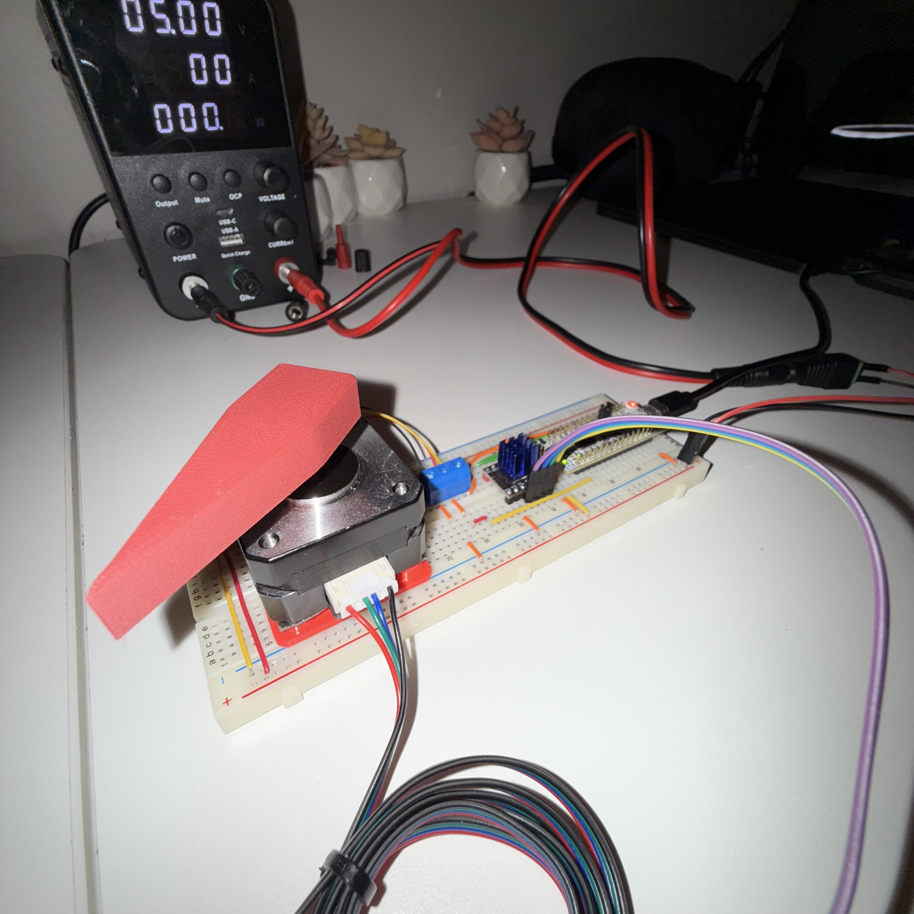

# STM32 Closed-Loop Stepper Motor Controller

  <table>
    <tr>
      <td width="50%" align="center">
        
         
        <em>Real-time closed-loop response demonstration</em>
      </td>
      <td width="50%" align="center">
        
          
        
         
        <em>System architecture and hardware implementation</em>
      </td>
    </tr>
  </table>

---

## Overview
This project implements a **closed-loop stepper motor controller** using an STM32 microcontroller and a magnetic rotary encoder.  
Unlike traditional open-loop stepper control, the system continuously measures actual shaft position and compares it against commanded motion, enabling immediate detection and correction of stalls, external disturbances, or missed steps.

The design emphasizes **deterministic timing, physical feedback, and minimal software complexity**, making it well-suited for embedded motor-control experimentation.

---

## Demonstration Behavior
The included demo intentionally uses a **human finger as a physical obstruction** to visualize collision and resistance detection.  
Only a **very small amount of opposing force** is required for the controller to recognize that commanded motion no longer matches measured encoder movement.  
Once this mismatch is detected, the system reacts immediately, demonstrating how even minimal resistance or contact with an external object can be identified reliably and in real time.

This showcases how the controller could be extended to detect collisions, soft end-stops, or human interaction in robotic or mechatronic systems.

---

## Functionality
- STEP/DIR-based stepper motor control  
- High-resolution absolute position feedback via magnetic encoder  
- Real-time comparison of expected vs. measured motion  
- Detection of stalls, resistance, and physical obstructions  
- Immediate corrective response without PID or FOC  
- UART-free runtime operation for timing consistency  

---

## System Architecture
1. **Motion Command Generation**  
   STEP pulses are produced at a fixed rate while the firmware tracks expected encoder displacement.

2. **Encoder Feedback Processing**  
   Absolute angle measurements are converted into incremental movement counts.

3. **Sliding-Window Validation**  
   Encoder motion is evaluated over a short time window to confirm correct direction and magnitude.

4. **Control Decision Logic**  
   Deviations beyond defined thresholds trigger corrective state changes such as direction reversal.

---

## Hardware Components
- STM32 microcontroller (G4 / F0 class)  
- STEP/DIR stepper motor driver (e.g., TMC-series)  
- Magnetic rotary encoder (AS5048A or equivalent)  
- NEMA-class stepper motor  
- External motor power supply  

---

## Applications
- Closed-loop stepper motor research  
- Collision and force-interaction detection  
- Robotic joints and actuators  
- Embedded motor-control education and prototyping  
